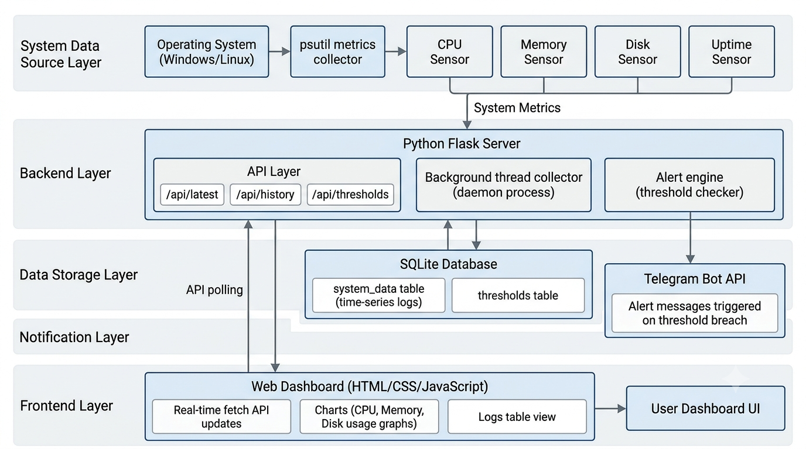
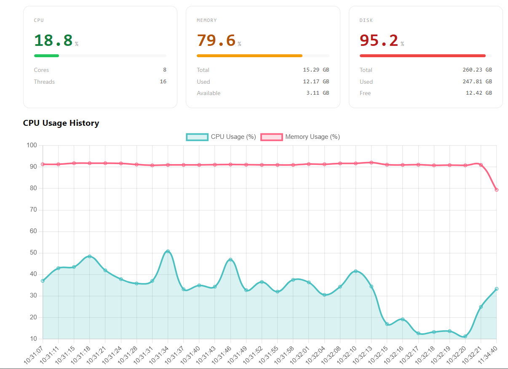
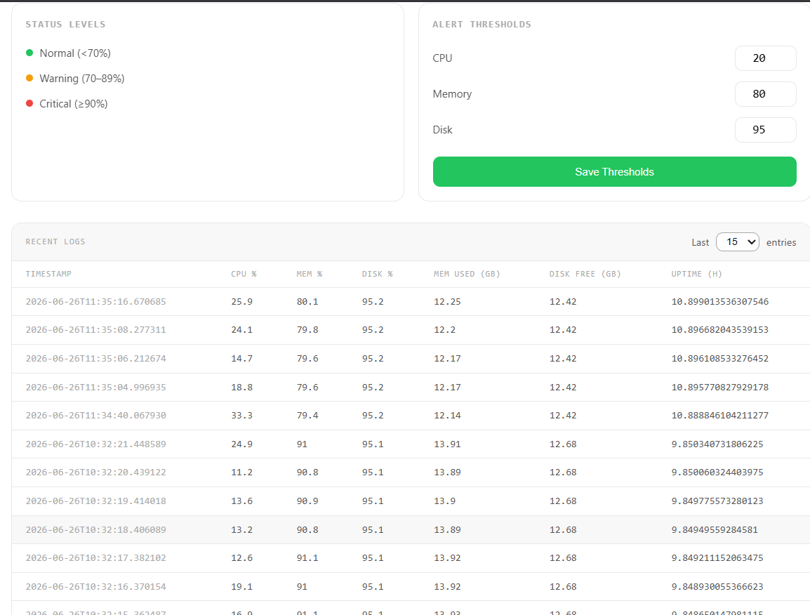
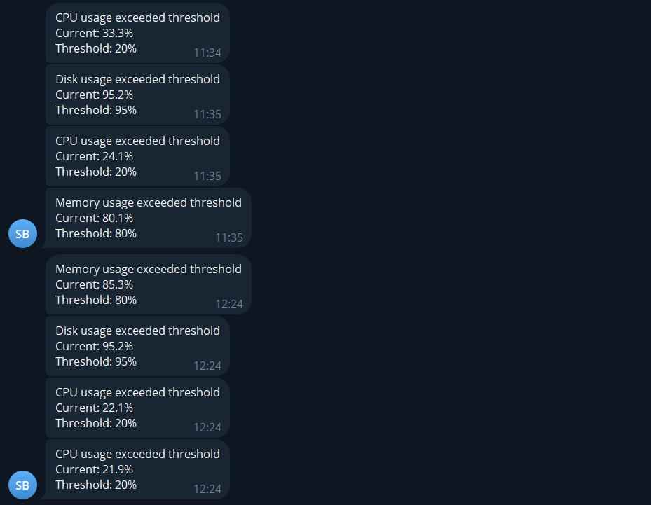

# Seaker Alert App

A lightweight real-time system monitoring and alerting platform that tracks CPU, memory, disk usage, and uptime, stores historical metrics in SQLite, visualizes system performance via a web dashboard, and sends instant Telegram alerts when configurable thresholds are exceeded.

---

## Overview

Seaker Alert App is a full-stack monitoring solution designed for continuous system observability. It runs a background telemetry collector that captures system metrics in real time, persists them in a lightweight database, and exposes a REST API consumed by a responsive frontend dashboard. When system resources exceed defined limits, the backend automatically triggers Telegram notifications.

The system is fully containerized for easy deployment across environments.

---

## Key Features

- **Real-Time System Monitoring** – Live tracking of CPU, memory, disk usage, and system uptime
- **Interactive Dashboard** – Clean UI with dynamic progress indicators and Chart.js-based visualizations
- **Historical Data Tracking** – Time-series storage and retrieval using SQLite
- **Custom Threshold Controls** – Configure CPU, memory, and disk limits directly from the UI
- **Automated Telegram Alerts** – Instant notifications via Telegram Bot API on threshold breaches
- **Background Daemon Collector** – Non-blocking telemetry collection using `psutil`
- **REST API Backend** – Structured endpoints for system data, history, and configuration
- **Docker Support** – Fully containerized for simple deployment

---

## System Architecture


### Architecture Overview

```text
       ┌────────────────────────────────────────┐
       │           Frontend Client              │
       │   (Vanilla JS / Chart.js / HTML5)     │
       └───────────────────┬────────────────────┘
                           │
                 REST API (JSON / HTTP)
                           │
       ┌───────────────────▼────────────────────┐
       │            Flask Backend               │
       │    (Routing, Controllers & Threading)  │
       └─────┬────────────────────────────┬─────┘
             │                            │
    Spawns Daemon Thread            Reads / Writes
             │                            │
┌────────────▼─────────────┐    ┌─────────▼─────────────┐
│ Background Collector     │    │ SQLite Database       │
│ (psutil System Telemetry)│    │ (system_data.db)      │
└────────────┬─────────────┘    └───────────────────────┘
             │
   Evaluates Thresholds
             │
┌────────────▼─────────────┐
│ Telegram Notification API│
│ (Instant External Alert) │
└──────────────────────────┘
```
## Block Diagram


---

## Technical Stack

- **Backend**: Python 3.12, Flask
- **Telemetry Extraction**: `psutil`
- **Database**: SQLite3
- **Frontend**: Vanilla JavaScript (ES6+), Chart.js, HTML5, CSS3
- **Alert Dispatcher**: Telegram Bot API
- **Containerization**: Docker

---
## Getting Telegram Bot Token & Chat ID

Seaker Alert App uses the Telegram Bot API to send real-time system alerts. To configure this integration, you need:

- **BOT_TOKEN** (generated from @BotFather)
- **CHAT_ID** (your unique Telegram user or group ID)

---

### 1. Create a Telegram Bot (Bot Token)

1. Open Telegram and search for **@BotFather**.
2. Start a chat and initialize it by sending:
   ```text
   /start
   ```
3. To build a new bot profile, send:
   ```text
   /newbot
   ```
4. Follow the on-screen instructions:
   - Provide a descriptive **display name** for your bot.
   - Choose a unique **username** (this must end explicitly with `bot`, e.g., `seaker_alert_bot`).
5. Upon successful completion, BotFather will output an access token similar to this:
   ```text
   123456789:AAHdfkjsdFJklsdfJklsdfjksdfJKSDF
   ```
   > 💡 **This value maps directly to your `BOT_TOKEN`.**

---

### 2. Retrieve Your Chat ID

#### Option A (Recommended): Telegram Bot API
1. Open a direct chat window with your newly created bot and send any arbitrary message (e.g., `"hi"`).
2. Open your web browser and navigate to the following URL format:
   
   [https://api.telegram.org/bot](https://api.telegram.org/bot)<YOUR_BOT_TOKEN>/getUpdates
   
   *(Make sure to replace `<YOUR_BOT_TOKEN>` with the exact string generated by BotFather).*
3. Locate the nested structure inside the JSON payload sequence:
   ```json
   {
     "ok": true,
     "result": [
       {
         "message": {
           "chat": {
             "id": 123456789
           }
         }
       }
     ]
   }
   ```
   >  **The numerical value of `id` represents your target `CHAT_ID`.**

#### Option B: Using @userinfobot
1. Search Telegram for the global account profile **@userinfobot**.
2. Start a conversation with the bot by clicking the initialization prompt.
3. The response text payload will instantly report your specific Telegram user ID string.
## Installation & Local Setup

### Prerequisites
- Python 3.12+ installed locally.
- A Telegram account to configure alert notifications.

### Steps

1. **Clone the Repository**
   ```bash
   git clone https://github.com/yourusername/seaker-alert-app.git
   cd seaker-alert-app
   ```

2. **Establish Environment Properties** Create a `.env` file inside the root workspace folder to configure your Telegram Bot credentials:
   ```env
   BOT_TOKEN=your_telegram_bot_token_here
   CHAT_ID=your_telegram_chat_or_channel_id_here
   ```


3 **Install Dependencies** Set up a virtual environment and run pip installer:
   ```bash
   python -m venv .venv
   source .venv/bin/activate  # On Windows use: .venv\Scripts\activate
   pip install -r requirements.txt
   ```

4 **Boot the Monitor Engine** Execute the wrapper file to automatically initialize the schema and spin up background processing:
   ```bash
   python run.py
   ```
   The interactive system dashboard will now be reachable at `http://localhost:5000`.

---

## Docker Setup Instructions

A preconfigured multi-stage build setup maps dependencies container-side.

1. **Build the Container Image**
   ```bash
   docker build -t seaker-alert-app .
   ```

2. **Execute the Application Container** Pass environmental runtime variables explicitly during initialization:
   ```bash
   docker run -d \
     -p 5000:5000 \
     -e BOT_TOKEN="your_telegram_bot_token_here" \
     -e CHAT_ID="your_telegram_chat_or_channel_id_here" \
     --name system-monitor \
     seaker-alert-app
   ```
3.  **Docker Hub Image**
```bash
https://hub.docker.com/r/<your-username>/seaker-alert-app
```
---

## API Endpoints Documentation

### 1. Fetch Current Infrastructure Matrix
- **Endpoint**: `/api/latest`
- **Method**: `GET`
- **Description**: Evaluates and responds with the latest written entry representing live system parameters.
- **Response Shape (`200 OK`)**:
  ```json
  {
    "id": 142,
    "timestamp": "2026-06-26T10:45:00.123456",
    "cpu_usage": 14.5,
    "cpu_cores": 8,
    "cpu_threads": 16,
    "memory_total_gb": 16.00,
    "memory_used_gb": 7.42,
    "memory_available_gb": 8.58,
    "memory_percentage": 46.4,
    "disk_total_gb": 512.00,
    "disk_used_gb": 210.50,
    "disk_free_gb": 301.50,
    "disk_percentage": 41.1,
    "uptime_hours": 24.5
  }
  ```

### 2. Query Historical Time-Series Logs
- **Endpoint**: `/api/history`
- **Method**: `POST`
- **Description**: Returns a structured sequence of historical records up to a designated cap value.
- **Payload Shape**:
  ```json
  { "count": 15 }
  ```
- **Response Shape (`200 OK`)**:
  ```json
  [
    {
      "timestamp": "2026-06-26T10:44:59.000",
      "cpu_usage": 12.1,
      "memory_percentage": 46.3,
      "disk_percentage": 41.1,
      "memory_used_gb": 7.41,
      "disk_free_gb": 301.50,
      "uptime_hours": 24.5
    }
  ]
  ```

### 3. Retrieve Configured Threshold Specifications
- **Endpoint**: `/api/thresholds`
- **Method**: `GET`
- **Description**: Queries active performance boundaries utilized for trigger notifications.
- **Response Shape (`200 OK`)**:
  ```json
  {
    "id": 1,
    "cpu": 80,
    "memory": 80,
    "disk": 90
  }
  ```

### 4. Update Critical Performance Thresholds
- **Endpoint**: `/api/thresholds`
- **Method**: `POST`
- **Description**: Updates application-wide warning parameters inside persistent database tables.
- **Payload Shape**:
  ```json
  {
    "cpu": 85,
    "memory": 75,
    "disk": 92
  }
  ```
### 5. Export Historical Monitoring Data
- **Endpoint**: `/api/export`
- **Method**: `POST`
- **Description**: Exports historical monitoring records from the database in either CSV or JSON format for offline analysis and archival purposes.
- **Payload Shape**:
  ```json
  {
    "count": 25,
    "type": "csv"
  }
  ```

  or

  ```json
  {
    "count": 25,
    "type": "json"
  }
  ```


- **Response (`200 OK`)**:
    - For `csv`: Returns a downloadable file named `system_logs.csv`
    - For `json`: Returns a downloadable file named `system_logs.json`

- **Example Request**:
  ```json
  {
    "count": 10,
    "type": "csv"
  }
  ```

- **Example JSON Export Output**:
  ```json
  [
    {
      "id": 142,
      "timestamp": "2026-06-26T10:45:00.123456",
      "cpu_usage": 14.5,
      "cpu_cores": 8,
      "cpu_threads": 16,
      "memory_total_gb": 16.0,
      "memory_available_gb": 8.58,
      "memory_used_gb": 7.42,
      "memory_percentage": 46.4,
      "disk_total_gb": 512.0,
      "disk_used_gb": 210.5,
      "disk_free_gb": 301.5,
      "disk_percentage": 41.1,
      "uptime_hours": 24.5
    }
  ]
  ```
---

## Alert System Explanation

Seaker Alert App includes a lightweight alert engine that continuously evaluates system metrics against user-defined thresholds.

- A background daemon checks system stats at regular intervals
- If a metric exceeds its threshold, an alert is triggered via Telegram Bot API
- Duplicate alerts are prevented using internal state tracking (last_alert)
- Alerts reset automatically once metrics return to safe levels


This ensures meaningful notifications without spam or redundancy.


---

## Usage Instructions

- **Dashboard Monitoring**: 
  - View real-time system metrics
  - Monitor CPU, memory, and disk usage visually
  - Track historical trends using interactive graphs
- **Logs & Historyl**: 
  - Query recent system snapshots
  - Analyze performance trends over time
- **Threshold Configuration**: 
  - Update limits directly from UI 
  - Changes apply instantly without restarting the server
---
## Dashboard
- Main UI

- Historical dashboard and threshold section

- Sample Telegram Alert

## Future Improvements

- [ ] Introduce secure token-based user authentication and multi-user profile configurations.
- [ ] Incorporate asynchronous WebSocket infrastructure paths for sub-second frontend synchronization layers.
- [ ] Expand telemetry instrumentation capturing network input/output bandwidth rates alongside specific process identifiers.
- [ ] Implement query engine aggregations to handle automatic historical data rotation strategies.

---

## Author

Developed by **Farzan R S**

## Resume
[View My Resume](/assets/farza_resume.pdf)

---
## License

This project is currently unlicensed. 

---

## Thank you for reading. Drop a star ⭐